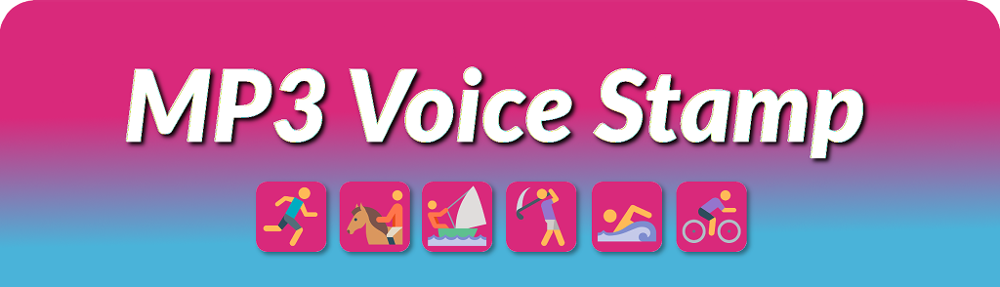

 Athletes' companion: add synthetized voice overlay with various info and on-going timer to your audio files

 
 
 
 
## Table of contents ##

 * [Introduction](#introduction)
 * [Demo MP3 file](#sample)
 * [Features](#features)
 * [Configuration and usage](docs/USAGE.md)
 * [Requirements and installation](docs/INSTALL.md)
 * [Bugs reports and pull requests](#contributing)
 * [Credits and license](#credits-and-license)
 * [What's new?](docs/CHANGES.md)

## Introduction ##
 
 Whenever you do any physical activities, there's high chance you bring your music with you. So do I, but I do swim 
 a lot and in my case, my audio player UI is pretty non existent. It has just 5 control buttons and that's it.
 You cannot even tell what track you selected, unless you recognize it. I personally prefer to swim with 
 so-called DJ mixes - 1 hour long (or more) mixed tracks of various artists just to keep music go without gaps
 between tracks. Having no UI in audio player brings at least two problems:
 
  * it is sometimes hard to tell what mix you just started to listen to (they often need some time to spin up or 
    feature the same opening intro jingle),
  * as there's no display to peek, you cannot easily tell how much time passed so you cannot tell how long you are 
    swimming already.
 
 The aim of this tool is to address these issues. The idea behind is quite simple: you take MP3 track of your choice
 and add synthetized voice overlay with required information. The voice tells what track title is (at its beginning)
 and then keeps speaking time passed at given intervals (each 5 minutes by default).

 > 
 > _One of unexpected outcome of using this tool while swimming is that while title announcement 
 > feature is just "useful one" and nothing more, then the "time ticks" works more like your personal trainer 
 > and for me it adds some motivational bits to my swimming which was completely unexpected. It seems like it 
 > puts kind of subtle pressure so I actually swim more, trying to hear next time "milestone" announced. 
 > It's like some sort of gamification in swimming in practice... Interesting :)_

## Sample ##

  One audio file tells more that thousands words, so why not try the example MP3 file now?
 Hear for yourself what this tool does in practice. For demo purposes time stamps are announced at one minute interval,
 starting at first minute of the track. Voice volume factor is x2.

 * [Listen on SoundCloud](https://soundcloud.com/marcinorlowski/mp3voicestamp-tool-demo)
 * [Download sample MP3 file](sample/mp3voicestamp-demo.mp3) (6 MiB size)

 ----
 
 
 And if you are interested in music, sample is based on Olga Misty's DJ mix "Ocean Planet 086 Part 2" which can be found on 
 [MixCloud](https://www.mixcloud.com/olgamisty/olga-misty-ocean-planet-086-part-2-aug-06-2018-on-proton-radio/) and
 [SoundCloud](https://soundcloud.com/olga_misty/olga-misty-ocean-planet-086-part-2-aug-06-2018-on-proton-radio).

## Features ##

 * Reading MP3 tags
 * Automatic voice volume adjustment based on music file volume
 * Preserves quality of original audio file
 * Pretty customizable
 * Minimal runtime dependencies
 * Free

## Requirements ##

 * [Python](https://www.python.org/) v2.7 or newer
 * required libraries:
   * [mutagen](https://github.com/quodlibet/mutagen/)
 * required tools:
   * [ffmpeg](https://www.ffmpeg.org/)
   * [normalize-audio](http://normalize.nongnu.org/)
   * [espeak](http://espeak.sourceforge.net/)
   * [sox](http://sox.sourceforge.net/)

 To install required Python libraries use `pip`:

    pip install -r requirements.txt

 To install required binaries (on Debian/Ubuntu):

    sudo apt install ffmpeg espeak normalize-audio sox

## Contributing ##

 Please report any issue spotted using [GitHub's project tracker](https://github.com/MarcinOrlowski/mp3voicestamp/issues).

 If you'd like to contribute to the this project, please [open new ticket](https://github.com/MarcinOrlowski/mp3voicestamp/issues)
 **before doing any work**. This will help us save your time in case I'd not be accept PR either completely or in proposed form.
 But if all is good and clear then follow common routine:

 * fork the project,
 * create new branch,
 * do your changes,
 * send pull request,
 * glory.
 
## Credits and license ##

 * Written and copyrighted &copy;2018 by Marcin Orlowski <mail (#) marcinorlowski (.) com>
 * MP3AudioStamp is open-sourced software licensed under the [MIT license](http://opensource.org/licenses/MIT)
 * Icons used in logo taken from free [Icons8 Olympics Sports Icon Pack](https://icons8.com/free-icons/olympics_sports)

